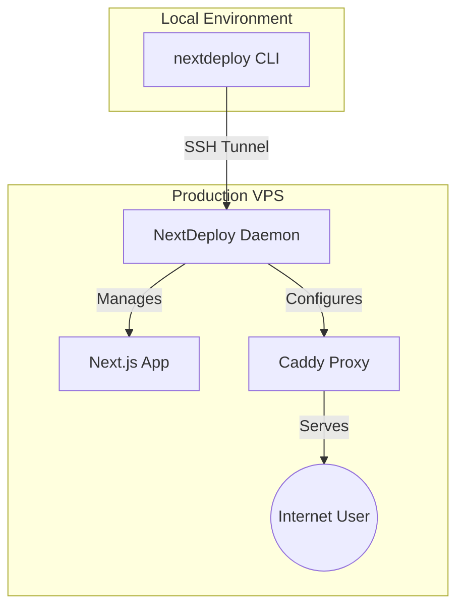

# 🚀 NextDeploy: The Zero-Downtime Deployment Engine

NextDeploy is a high-performance, developer-first deployment engine designed to give you **total ownership** of your Next.js applications. It transforms any VPS into a premium hosting platform, bypassing the lock-in and complexity of traditional cloud providers.

---

## 🎨 Philosophy: Native. Transparent. Fast.

NextDeploy was born from a simple idea: **deployment shouldn't be a black box.** 

Most platforms force you into proprietary runtimes or complex container orchestrators. NextDeploy takes a different path:
- **Native Execution**: We run your app directly on the metal (using Bun or Node), maximizing performance and minimizing overhead.
- **Zero-Downtime**: Our daemon-driven architecture ensures that new releases are swapped seamlessly, with automatic rollbacks if the health check fails.
- **Full Control**: You own the server, you own the secrets, you own the logs. We just provide the magic to get it there.

---

## 🏗️ Architecture: The Triple-Threat

NextDeploy operates as a beautifully coordinated dance between three components:

1. **The CLI (Command & Control)**: Your local companion. It builds your app, encrypts your secrets, and coordinates with the server via encrypted SSH tunnels.
2. **The Daemon (The Brain)**: A lightweight Go process running on your server. It manages the application lifecycle, allocates ports, swaps releases, and monitors health.
3. **Caddy (The Gatekeeper)**: A world-class reverse proxy that handles automatic TLS (HTTPS), Gzip/Zstd compression, and smart routing.

---

## 🛠️ Command Reference

NextDeploy provides a streamlined toolbelt for every stage of the lifecycle:

| Command | Description |
| :--- | :--- |
| `nextdeploy init` | Scaffolds your project and generates a `nextdeploy.yml`. |
| `nextdeploy ship` | The "Magic Button". Builds, uploads, and deploys your app with zero downtime. |
| `nextdeploy logs` | Streams native systemd logs directly to your local terminal. |
| `nextdeploy status` | Real-time health check: PID, Memory usage, and Uptime. |
| `nextdeploy secrets` | Securely manage Environment Variables (Set, Get, List). |
| `nextdeploy update` | Self-updating CLI. Always stay on the latest version. |
| `nextdeploy build` | Pre-processes your Next.js app for production. |
| `nextdeploy run` | Simulates the production environment locally for testing. |

---

## 🔐 Security & Secrets

Secrets are first-class citizens in NextDeploy. They are:
1. **Transport-Secured**: Delivered via SSH tunnels (never raw HTTP).
2. **FileSystem-Hardened**: Stored in root-restricted JSON files (`0600`).
3. **Ghost-Injected**: Passed to your app via systemd's `EnvironmentFile`, keeping them invisible to process-scanning tools.

---

## 📈 Getting Started

Ready to reclaim your infrastructure?

1. **Install**: `curl -sSf https://nextdeploy.one/install.sh | sh`
2. **Init**: Run `nextdeploy init` in your Next.js project.
3. **Ship**: Point it to your server and run `nextdeploy ship`.

**Zero configuration. Zero lock-in. Total magic.**
