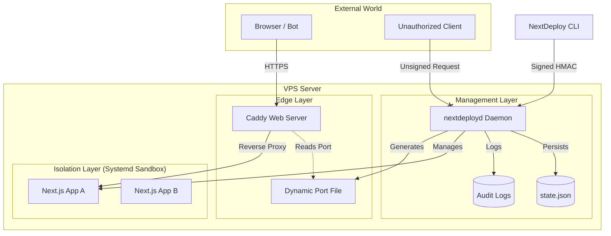

# Architecture Overview - Secured VPS Deployment

This document provides an in-depth look at how the `nextdeploy` system is architected to be secure, resilient, and resistant to common "bots and hacks."

## 1. Request Flow & Logic

### A. Deployment Flow (CLI to Daemon)
When you run `nextdeploy ship`, the following sequence occurs:
1.  **Authentication**: The CLI generates an **HMAC-SHA256 signature** using a shared secret.
2.  **Transport**: The request is sent via a **Unix Socket** (local) or **mTLS** (remote TCP), ensuring only authorized clients can talk to the daemon.
3.  **Validation**: The `nextdeployd` daemon verifies the signature and checks its security policies.
4.  **Isolation**: The daemon generates a **Hardened Systemd Sandbox**. The diagram shows 3 apps to illustrate that each app lives in its own "bubble"—a hack in one cannot spread to others.
5.  **Connectivity**: The daemon assigns a persistent port for Caddy to find.

### B. User Traffic Flow (Browser to Next.js)
1.  **Ingress**: Traffic hits **Caddy** via HTTPS.
2.  **Filtering (WAF Layer)**: Integrated **Coraza WAF** with the OWASP Core Ruleset (CRS) to block SQLi/XSS attacks before they reach the sandbox.
3.  **Proxying**: Caddy resolves the backend port dynamically.
4.  **Execution**: Next.js handles the request within its isolated systemd sandbox.

## 2. In-Depth System Design

## 3. Defense Against "Bots and Hacks"

| Threat | Defense Strategy | Mechanism |
| :--- | :--- | :--- |
| **Brute Force / DoS** | **Rate Limiting** | Daemon uses a token-bucket limiter; Caddy handles HTTP-level limits. |
| **Unauthorized Commands**| **HMAC & mTLS** | Every daemon command is cryptographically signed; TCP is protected by mTLS. |
| **Process Escape** | **Systemd Isolation** | `ProtectSystem=strict`, `DynamicUser=yes`, and kernel namespaces restrict the app to its data dir. |
| **Man-in-the-Middle** | **TLS 1.2+** | All communication (internal and external) is encrypted. |
| **Port Scanning** | **Dynamic Allocation** | Apps run on high, random, persistent ports not exposed to the public internet. |
| **Vulnerability Scanning** | **Security Headers** | CSP, HSTS, and X-Content-Type-Options prevent common web-based hacks. |
| **App-Level Attacks** | **Coraza WAF** | Integrated OWASP CRS provides real-time protection against SQLi and XSS. |

## 4. Visual Representation
Below is a conceptual visualization of the architecture:

